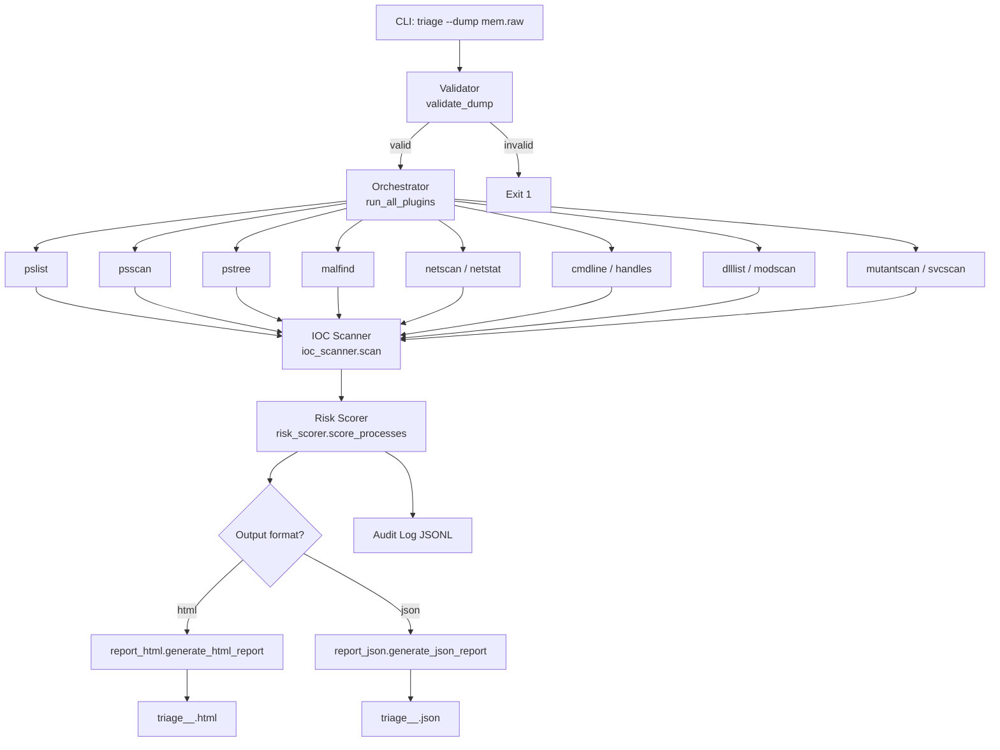

# Architecture

## High-Level Flow



## Component Descriptions

### CLI (`src/triage/cli.py`)
Entry point via `triage` command (defined in `pyproject.toml` `[project.scripts]`).
Accepts `--dump`, `--output`, `--ioc-db`, `--out-dir`, `--profile`, `--verbose`.
Orchestrates the 5-step pipeline and prints a colour-coded verdict banner.

### Validator (`src/triage/validator.py`)
Performs two levels of validation:
1. File-level: exists, is a file, is non-empty.
2. Volatility-level: attempts to run automagic layer detection on the dump.
   Returns `{"valid": bool, "os_profile": str|None, "error": str|None}`.

### Orchestrator (`src/triage/orchestrator.py`)
Uses `concurrent.futures.ThreadPoolExecutor(max_workers=6)` to run all 12 plugins
concurrently. Each plugin is wrapped to catch exceptions, which are stored in the
`error` field of the result dict. A 60-second per-plugin timeout is enforced.
Returns `(results_dict, total_duration_s)`.

### Plugin Layer (`src/triage/plugins/`)
`base.py` contains `run_volatility_plugin(plugin_class, dump_path, profile)`.
It creates a fresh `volatility3.framework.contexts.Context` per call (thread-safe),
runs automagic, constructs the plugin, runs it, and visits the TreeGrid output
using the `visit()` callback pattern.

Each of the 12 plugin files (`pslist.py`, `psscan.py`, etc.) imports its
Volatility 3 class and calls `run_volatility_plugin`.

### IOC Scanner (`src/triage/ioc_scanner.py`)
Loads all YAML files from `data/iocs/` on each scan (in practice called once per run).
Iterates through indicators by type and cross-references plugin output:
- `process_name` → pslist / psscan `ImageFileName`
- `mutex` → mutantscan `Name`
- `network_ip` → netscan / netstat `ForeignAddr`
- `file_path` → dlllist / handles `Path` / `FullDllName` (substring)
- `registry_key` → svcscan / handles (substring)

Returns a flat list of match dicts.

### Risk Scorer (`src/triage/risk_scorer.py`)
Per-process scoring with additive weights:
| Condition | Points |
|---|---|
| Malfind hit (executable private memory) | +40 |
| Suspicious parent (e.g. cmd.exe from Word.exe) | +20 |
| Known-bad image path (TEMP / AppData) | +15 |
| Unexpected network for process type | +15 |
| Per IOC match | +10 |

Processes on the legitimate Windows whitelist have their score halved.
Score capped at 100. Verdict: Clean <30, Suspicious 30-69, Compromised ≥70.

### Report Generators
- `report_html.py`: Jinja2 template rendering → polished HTML with Tailwind CSS
- `report_json.py`: JSON dump of `report_data` for SIEM ingestion

### Audit Log (`src/triage/audit_log.py`)
JSONL structured log written to `triage_audit.jsonl` in the project root.
Each line is a JSON object with `timestamp`, `event`, and contextual fields.

## Threading Model

ThreadPoolExecutor with `max_workers=6` was chosen because:
- Volatility 3 is CPU-bound per plugin but also does significant I/O (reading dump pages)
- Threads share file handles on the dump, avoiding duplicate open() calls per process
- ProcessPoolExecutor would require pickling Volatility context objects (not supported)
- `max_workers=6` balances parallelism against RAM pressure on large (>4 GB) dumps

## Data Flow

```
Memory Dump (.raw)
    │
    ▼
Validator ──→ OS Profile hint
    │
    ▼
12 Volatility 3 Plugins (parallel)
    │
    ▼
plugin_results: {plugin_name: {rows: [dict], error: str|None, duration_s: float}}
    │
    ├──→ IOC Scanner ──→ ioc_matches: [{ioc, plugin, process_pid, process_name, context}]
    │
    ├──→ Risk Scorer ──→ scored_processes: [{pid, name, risk_score, verdict, risk_factors}]
    │                  (uses both plugin_results and ioc_matches)
    │
    └──→ Report Generator ──→ HTML or JSON report
```
